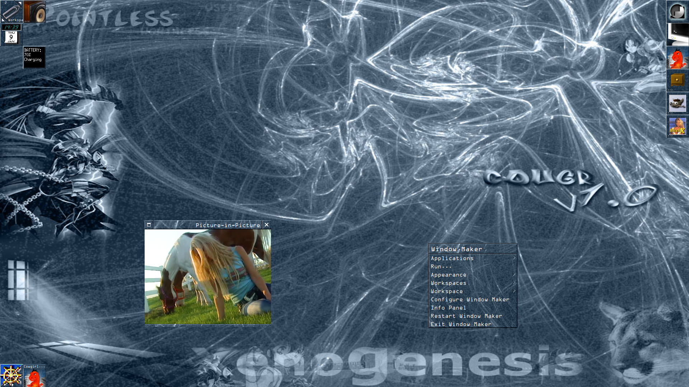
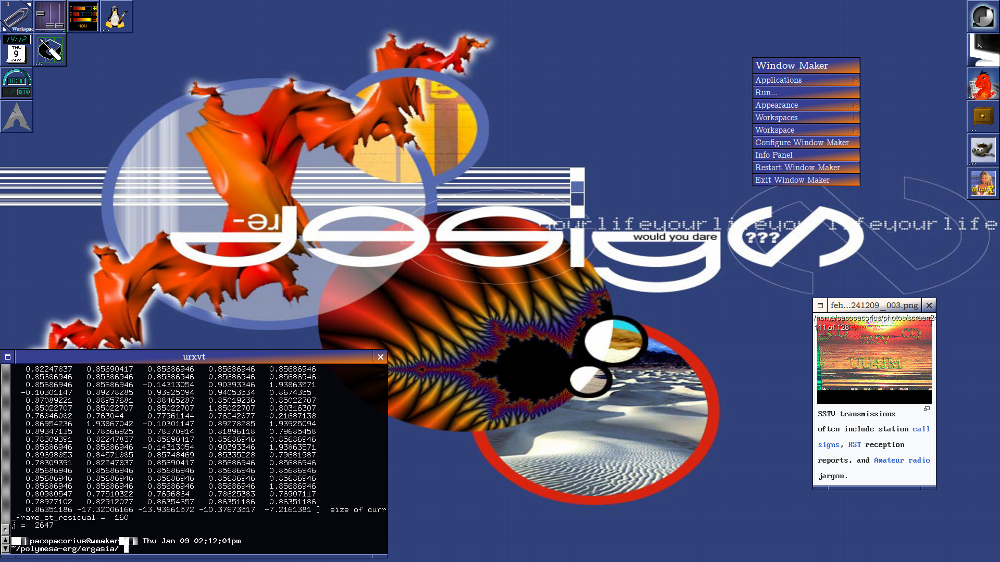
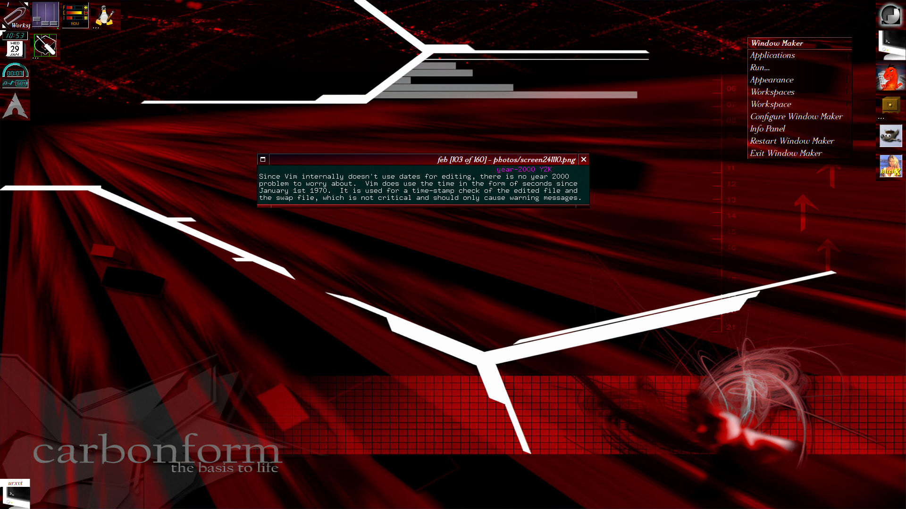

# Custom WindowMaker themes
Here are some WindowMaker themes I made myself using this great [tutorial](https://lonelymachines.org/windowmaker-themes/theme-tutorial/).
Check this website out, it has a ton of awesome WindowMaker themes.
Most wallpapers were taken from [Desktop Imperium](https://web.archive.org/web/20010215034639/http://desktop.chapter3.net/).
I will try including the fonts I used for each theme, if possible. 

May I add that I am no design expert, some of these may look pretty bad. 
I still like them, so just deal.
Some themes may work better on 1028x720 resolution rather than 1920x1080 
due to the wallpapers being over 20 years old now. Maybe some AI upscalers 
would be of help?

Feel free to use them with your WindowMaker install. If you want to post 
these on your site for whatever reason, or think you can do better than me and
make a new theme based on the ones hosted here, all I ask is you link back to 
this repo in some way and mention me. Enjoy the themes!

## Examples

* cougr1.0
    
* redesign_yourlife
    
* carbonform
    

## How To Install
Drop the theme folders in your `~/GNUStep/Library/WindowMaker/Themes/` folder. Ez.
